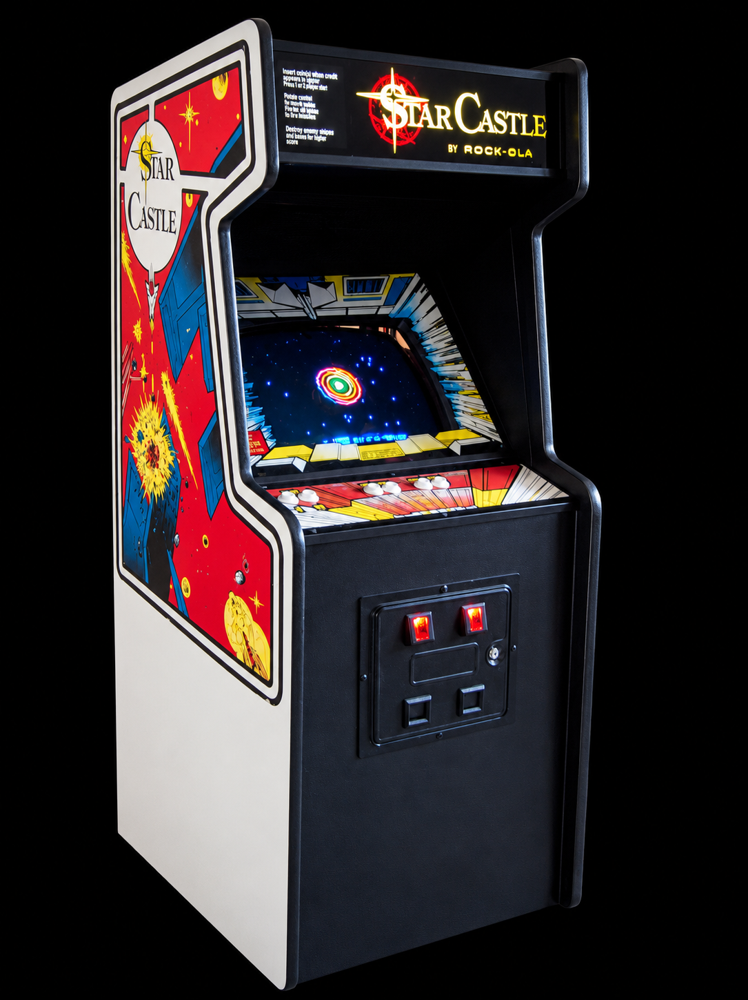
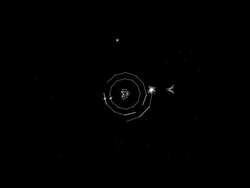

# Cinematronics vector arcade hardware for MiSTer FPGA

An FPGA implementation of Cinematronics vector arcade hardware for the
[MiSTer FPGA](https://github.com/MiSTer-devel/Main_MiSTer/wiki) platform,
starting with **Star Castle (version 3)**.

Private development repository.
The intended progression is Star Castle, Rip Off, Armor Attack, Solar Quest,
then the other CCPU games after their controls, sound and board differences
have been implemented and checked.

<p align="center">
  
  
</p>

> **Status:** Star Castle has passed a full-game hardware test. The current
> build passes simulation, fitting and reported timing, and sound has been
> confirmed working on MiSTer.
>
> **Known issues:** the released build is grayscale; colour-overlay support
> passes simulation and awaits its hardware build/check. Persistence remains
> uncalibrated, and frame tearing is possible. Sound works, but exact analog
> fidelity and channel balance remain uncalibrated. Feedback and bug reports
> are welcome via [Issues](https://github.com/Usquebagh/Arcade-Cinematronics_MiSTer/issues).

---

Implemented:

- Synthesizable SystemVerilog CCPU instruction executor, including the two
  12-bit accumulators, 256 x 12-bit RAM, banking, delayed MI flags, vector
  normalization, multiply steps, I/O and frame wait.
- Synchronous 8 KiB writable program ROM with Star Castle's bank mirrors.
- ROM preparation tool that verifies all four program chips before interleaving.
- Differential tests against the original execution function from a pinned
  BSD-licensed MAME reference. Tests include every opcode and an optional run
  with the locally supplied game ROM.
- Component synthesis checks for Yosys and Quartus Lite 17.0.2.
- Clipped line rasterizer and double-buffered 512x384, 16-level grayscale
  framebuffer with synchronous scanout and overlap intensity preservation.
- End-to-end captured-frame tests and a reproducible simulation preview.
- CPU, ROM, queued vectors and framebuffer connected to exact-average CPU
  enables, hardware frame ticks, controls, DIP wiring, latched coin and watchdog.
- Live-machine tests exercise coin/start and gameplay controls while comparing
  retired instructions and all displayed pixels to the references.
- MiSTer platform wrapper with validated HPS ROM downloads, DIP settings,
  keyboard/controller inputs, native progressive scanout and a Star Castle MRA.
- Synthesized sound-board model with serial control latches, eight effect
  channels, filtered noise, VCOs, RC envelopes and signed mono audio.
- Shared colour-overlay compositor with a Star Castle profile, monochrome
  bypass, vector brightness and overlay-strength controls.

The MAME-compatible CPU behavior is a starting point. Physical CPU timing,
draw-busy timing, calibrated intensity/persistence and analog sound fidelity
remain to be established. A full game has been played successfully on hardware.
The first complete MiSTer build passes fitting and
reported internal timing; the development RBF and MRA are in `releases/`.
See [sound implementation and limits](docs/sound.md) for the new audio model.
See [colour overlays and video controls](docs/colour.md) for the new display stage.
QB-3's banking and video differences are outside this baseline.

## Run the tests

From Linux or WSL, with Python 3, Verilator, Icarus Verilog, Yosys, GNU Make
and a C++ compiler:

```sh
bash sim/run.sh
python3 tools/prepare_starcastle.py games/mame/starcas.zip
bash sim/run.sh build/roms/starcastle.bin
bash tools/synth.sh
bash tools/synth.sh --quartus
bash sim/run_vector.sh
bash sim/run.sh build/roms/starcastle.bin build/vectors.csv
bash sim/run_vector.sh build/vectors.csv build/vector/starcastle.pgm
python3 tools/preview_vector.py build/vector/starcastle.pgm build/vector/starcastle.png
bash tools/synth_vector.sh --quartus
bash sim/run_machine.sh
bash sim/run_machine.sh build/roms/starcastle.bin build/machine/starcastle.pgm
python3 tools/preview_vector.py build/machine/starcastle.pgm build/machine/starcastle.png
bash tools/synth_machine.sh --quartus
bash sim/run_sound.sh
bash sim/run_overlay.sh
```

The optional Quartus check uses the Docker image
`theypsilon/quartus-lite-c5:17.0.2`, matching the existing Jedi/Fire Trap setup.
It performs component analysis and synthesis, not fitting, timing closure or
RBF generation. The simulation script handles workspace paths containing spaces.

ROMs, archival PDFs, derived ROM images and temporary build products are ignored
by Git. Verified development RBFs can be committed under `releases/`.
CI runs with synthetic programs only; it does not download or require game ROMs.

## MiSTer build

Run `bash sim/run_mister.sh` to check downloads, controls, video timing and MRA
ordering without ROMs. `bash build.sh` uses the installed Quartus Docker image
for a full DE10-Nano compile. See [MiSTer integration](docs/mister-integration.md)
for platform provenance, installation, controls and current limitations.
The [release notes](releases/README.md) give the SD-card locations and controls
for hardware testing. The current build includes synthesized audio.
Frame tearing is still possible.

See [architecture](docs/architecture.md), [development milestones](docs/roadmap.md),
[reference provenance](docs/references.md) and [validation](docs/validation.md).

## License and credits

Original CPU/machine/video modules and tools are BSD-3-Clause; see
[BSD license](LICENSES/Cinematronics-BSD-3-Clause.txt). The CCPU instruction
semantics and differential reference come from Aaron Giles' BSD-3-Clause MAME
CCPU, with credits and its license preserved in `sim/reference/` and `LICENSES/`.
Zonn Moore's programmer's reference and the supplied schematics are hardware
references, kept locally. Game ROMs and scanned manuals are not distributed.
Imported MiSTer framework components retain their own licenses. The integrated
MiSTer core is GPL-3.0-or-later; see [LICENSE](LICENSE). Original
modules and tools remain BSD-3-Clause individually.
